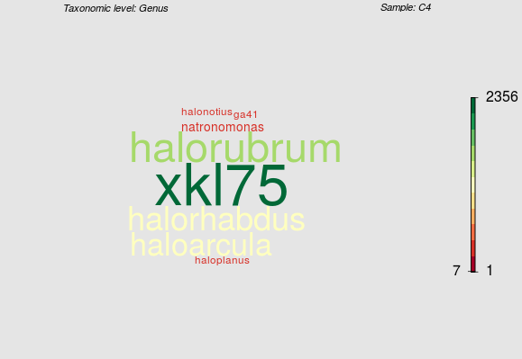

# clOTU

Basic idea for this function is to substitute the classical barplot representation of microbial abundance when low numbers (1-2) samples are considered. It was designed for the analysis of microbiome data obtained after NGS sequencing, which were analyzed through the QIIME pipeline, and which are handled in R through phyloseq package.

clOTU is still very beta, it is quite slow and plotting is still far from optimal.

Here an example. The color and size of the word reflect the number of reads per taxonomic "entity" (in this example per genus). Color is mapped by the scale on the right, where mark and numbers represent min, median, and max of reads.

